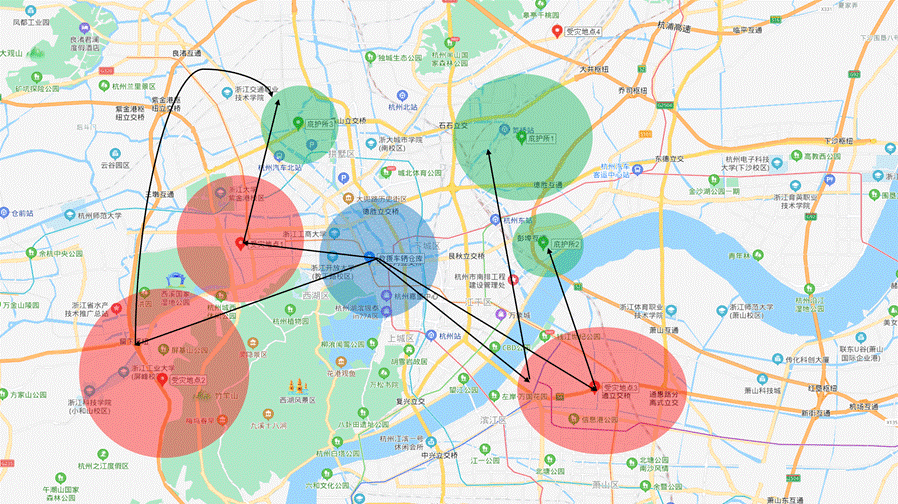
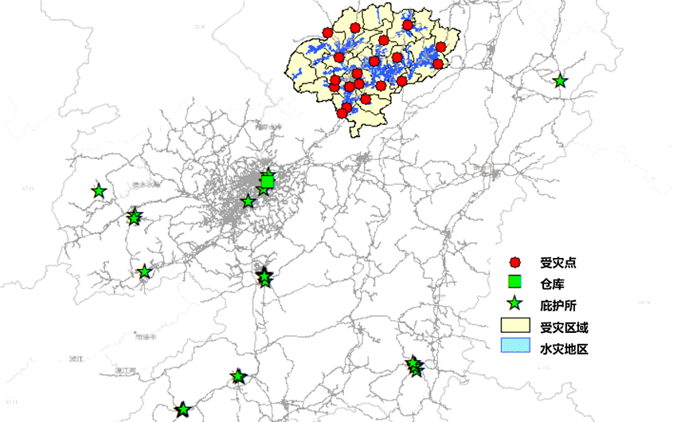
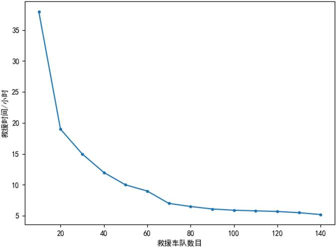
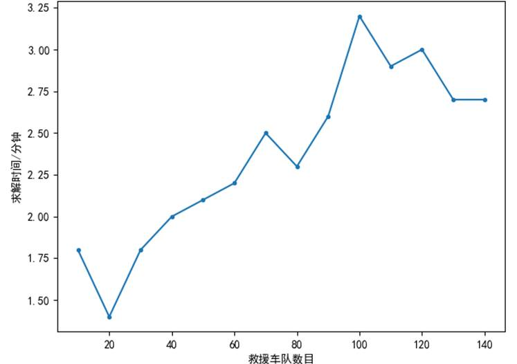

# 基于遗传算法的人员应急疏散优化方案 
***Optimization Plan for Emergency Evacuation of Personnel Based on Genetic Algorithm***

## 项目背景 | ***Background of Project***
大规模灾害中人员应急疏散是避免或减少人员伤亡的必要措施。但人员疏散的优化是一NP难问题，给大规模救助的快速实施造成了极大的困难。本课题探讨使用遗传算法来寻求人员疏散方案，平衡求解时间和优化的矛盾，以期在较短的时间里求得一个较优的方案。

*Emergency evacuation in large-scale disasters is a necessary measure to avoid or reduce casualties. However, the optimization of personnel evacuation is an NP-hard problem, which has caused great difficulties for the rapid implementation of large-scale rescue. This topic explores the use of genetic algorithms to find a plan for evacuation, balancing the contradiction between solution time and optimization, in order to find a better plan in a shorter time.*

## 项目结构 | ***Architecture of Project***

本研究提出了一种新的灾后受灾人员转移疏散时的路径规划算法，目前已开源的代码位于`Code`文件夹下，其分为两部分，其中第一部分（`Problem1`）为本算法应用于浙江杭州的某重大灾害后受灾人员转移疏散方案的路径规划的性能研究；第二部分（`Problem2`）为本算法应用于江西兴国洪灾后受灾人员转移疏散方案的路径规划的性能研究。

`Reference`文件夹下列出了部分建议的英文参考文献，有志于从事相关研究的研究者们可以进一步阅读

其他研究工作将在后续进一步开源

*This research proposes a new path planning algorithm for the evacuation of the victims after a disaster. The open source code is located in the `Code` folder, which is divided into two parts. The first part (`Problem1`) is the application of this algorithm. Research on the performance of the path planning of the evacuation plan for the displaced persons after a major disaster in Hangzhou, Zhejiang; The second part (`Problem2`) is the performance research of the algorithm applied to the route planning of the evacuation plan for the displaced persons after the Xingguo flood in Jiangxi.*

*Some suggested English references are listed in the `Reference` folder. Researchers interested in related research can read further*

*Other research work will be further open sourced in the future.*

## 场景1 | 浙江杭州重大灾害研究

本研究拟以杭州地发生的重大灾害或事故为背景展开人员疏散问题的研究，并采用疏散完成时间最短模型，也即以最终完成救援时间耗时最短为优化目标。由于实际的灾后人员疏散及调度问题较为复杂，为了研究方便，本研究拟对实际问题中涉及到的场景进行一定程度上的简化，为此我们不妨考察如下图所示的简化后的模型。

**图** **2** **一个灾害事故后公交救援问题的场景**

 

在上图所示模型中，杭州市面临某灾害影响，因而有3个受灾的地点的若干受灾人员需要被疏散，城市中有3个用于接收受灾群众的庇护所，用于转移受灾群众的公交巴士从统一的仓库出发前往不同受灾地点，并在受灾地点搭载受灾群众转移至庇护所，此后巴士将在受灾地点和庇护所之间往返以转移受灾人员，直至所有受灾人员均已被安全转移至庇护所。在完成受灾人员的转移后，用于转移受灾群众的巴士将不返回救援车辆的仓库，而是停留在其最后所在的庇护所随时待命，等待后续救援任务。

对于上述场景中的救援问题，本研究拟采用如下图所示的模型进行研究。图中S及T分别代表受灾地点和庇护所，起点则代表用于救援的公交汽车仓库。

本项目对此问题建模为混合整数线性程序，并进行了求解。

## 场景2 | 江西兴国水灾研究

本场景对2019年6月发生在江西省赣州市兴国县的洪灾进行了研究。这场灾难影响了大约412600人，其中约66000人被送往收容所。下图显示了在这次灾害救援中的受灾地点、车库及拟征用的避难所的地理分布示意图。

### 研究假设

本研究中进行了一些必要的假设以对模型进行求解：

（1）避难所数量及各个避难所容量上限是根据当地政府报告估算的。如下表所示，共考虑了25个避难所，这些避难所的总容量为408000人。

| 避难所序号 | 避难所容量 | 避难所序号 | 避难所容量 |
| ---------- | ---------- | ---------- | ---------- |
| 1          | 6500       | 14         | 3000       |
| 2          | 2500       | 15         | 5100       |
| 3          | 2000       | 16         | 11350      |
| 4          | 10760      | 17         | 1500       |
| 5          | 4494       | 18         | 9800       |
| 6          | 7000       | 19         | 23345      |
| 7          | 4500       | 20         | 35684      |
| 8          | 7700       | 21         | 4000       |
| 9          | 5000       | 22         | 7500       |
| 10         | 46200      | 23         | 26000      |
| 11         | 4000       | 24         | 5000       |
| 12         | 124666     | 25         | 500        |
| 13         | 50000      |            |            |

（2）依据该地区的灾害情况和人口密度对每个城镇的受灾人数进行估计。本研究采纳的基本数据如下：兴国县的总疏散人数为6.6万人，分布在22个村庄。下表显示了需要疏散的各个村庄的人口。

| 受灾点编号 | 受灾人数 | 受灾点编号 | 受灾人数 |
| ---------- | -------- | ---------- | -------- |
| 1          | 1437     | 12         | 493      |
| 2          | 2685     | 13         | 8160     |
| 3          | 813      | 14         | 1582     |
| 4          | 491      | 15         | 1392     |
| 5          | 6462     | 16         | 13394    |
| 6          | 2949     | 17         | 231      |
| 7          | 3921     | 18         | 5255     |
| 8          | 654      | 19         | 785      |
| 9          | 492      | 20         | 1766     |
| 10         | 4093     | 21         | 2110     |
| 11         | 6756     | 22         | 756      |

（3）将距离每个危险城镇中心最近的公共汽车站的位置标记为受灾地点的位置，以确保参与救援的公共汽车能够最快到达受灾群众所在位置并开展救援。考虑到当地的行政区划，本研究中设计了22个受灾群众集中点。

（4）在受灾地点附近规模最大的避难所附近设置了存放救援车辆的仓库。

（5）由于每个受灾点都有大量的待疏散受灾群众，因此将参与救援的汽车编组为公共交通车队，即每总载客量为500人的10辆公共汽车被编组为一组参与救援的车队，在救援路径规划中将同一车队中的公共汽车视作同一个整体，本研究中设计的参与救援车队数量从15个到140个不等。所有参与救援的公共汽车都从车库出发。

（6）不同地点之间的行驶时间由麻省理工学院的生物信息学工具箱计算，本研究中假设在不同道路上行驶的公交车的速度为20公里/小时至120公里/小时不等，具体的公交车行驶速度主要取决于道路的损坏情况及道路拥塞状况，在路网的车辆行驶时间是不对称的，也即从A点到B点的行驶时间不一定与从B点到A点的行驶时间相同。

### 实验评价与结果

实验结果表明，随着车队数量的增加，疏散时间从超过1天逐渐减少到约4小时，随着救援车队数目的逐渐增加，救援时间的降低趋势逐渐减小。对于本实例而言，当车队数目超过70时，随着救援车队数目的增加，疏散时间的改善迅速衰减。

